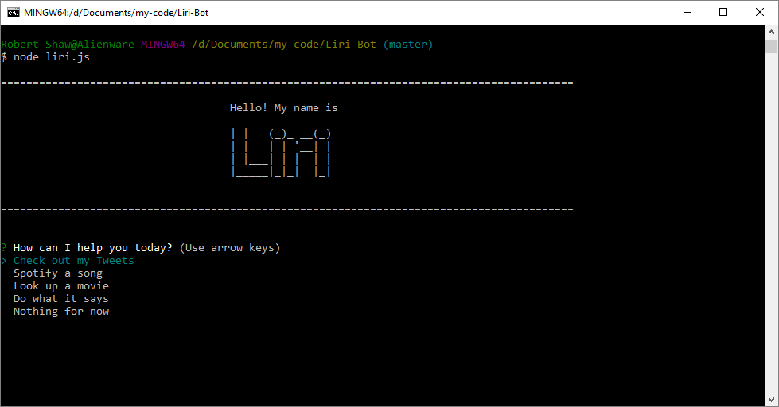
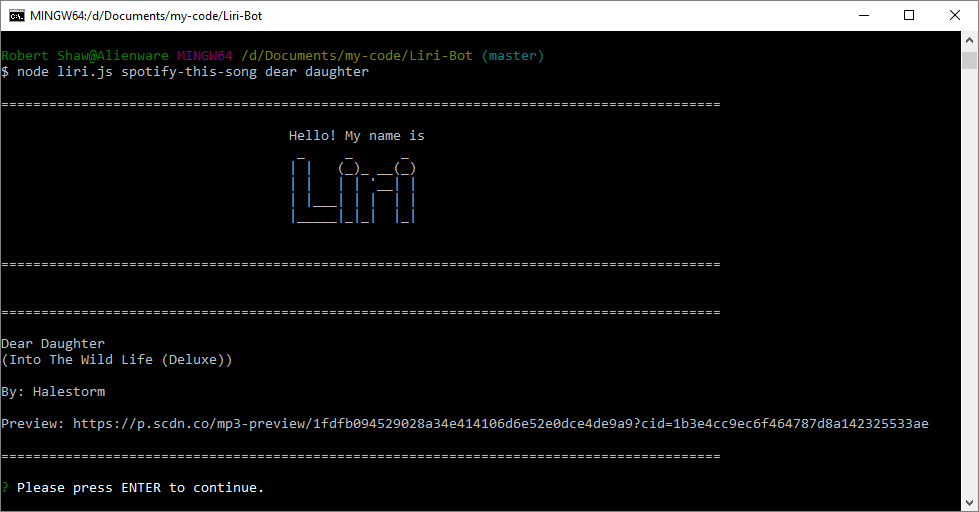
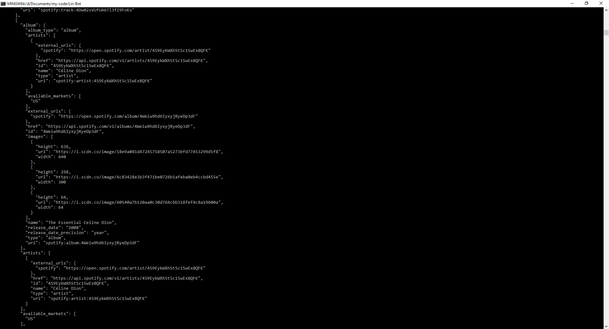
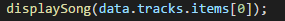
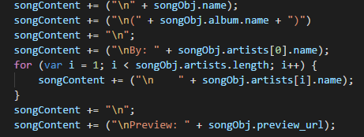

# Liri-Bot

Siri's Little Sister. This is a Language Interpretation and Recognition Interface. Tell it what you want to do, and it will execute your request to the best of its ability.


## Getting Started

Download the repository. Then, navigate to the folder and run install from your node package manager. You will need to make a .env file with your own API keys for twitter and spotify. If everything is installed, when you run liri.js, you should get a screen like this:



Select what you want Liri to do and then follow the on screen instructions. If there's any issues, Liri will let you know!

Or, if you want to jump in and get a response right away, you can pass in the following command line arguments:

```
my-tweets
spotify-this-song
movie-this
do-what-it-says
```

If you don't specify what you want `my-tweets`, `spotify-this-song`, or `movie-this` to look up, Liri will use a default search term.




### Prerequisites

You must have node installed in your terminal with support for the Node Package Manager.

### Installing

[Node.js Website](https://nodejs.org/en/)

Navigate to the Node.js website and follow the instructions to install Node. Then navigate to the project folder in your terminal.
```
/c/.../Liri-Bot/
```

Within that folder, run
```
npm install
```
and setup your `.env` file with your api keys for Twitter and Spotify. Your `.env` file should look like this:

```
# Spotify API keys

SPOTIFY_ID=your-spotify-id
SPOTIFY_SECRET=your-spotify-secret

# Twitter API keys

TWITTER_CONSUMER_KEY=your-twitter-consumer-key
TWITTER_CONSUMER_SECRET=your-twitter-consumer-secret
TWITTER_ACCESS_TOKEN_KEY=your-access-token-key
TWITTER_ACCESS_TOKEN_SECRET=your-twitter-access-token-secret

```
With your API keys replacing the placeholders.

## Built With

* [Javascript](https://www.javascript.com/) - The scripting language used

* [Node.js](https://nodejs.org/en/) - JavaScript runtime

* [Node Package Manager](https://www.npmjs.com/) - Package manager for JavaScript and Node

* [dotenv](https://www.npmjs.com/package/dotenv) - Keeps API keys private

* [Request](https://www.npmjs.com/package/request) - Make http calls

* [Node Spotify API](https://www.npmjs.com/package/node-spotify-api) - Interact with the Spotify API

* [Twitter for Node.js](https://www.npmjs.com/package/twitter) - Interact with the Twitter API

* [Inquirer](https://www.npmjs.com/package/inquirer) - Command line user interface

* [moment](https://www.npmjs.com/package/moment) - Time and Date math and display

* [figlet](https://www.npmjs.com/package/figlet) - ASCII word art

## Challenges

This is my first step away from the front end. I'm really enjoying just working in the terminal. The most challenging part of this project was actually figuring out Spotify's JSON data structure. Diving into it in the terminal wasn't the easiest because of the sheer amount of the data. 



In the end, I split it into finding the song object from the initial reponse and then diving into the song object afterwards.




## Authors

* **Robert Shaw** - *Initial work* - [robertshaw87](https://github.com/robertshaw87)